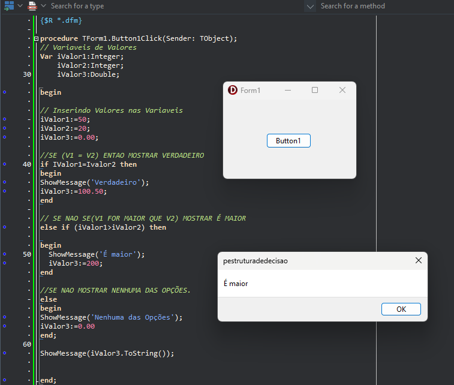

📌 Delphi – Estruturas de Decisão

Este repositório é um projeto de estudo em Delphi criado para praticar e entender melhor o uso das estruturas de decisão da linguagem Object Pascal.

A ideia foi desenvolver um projeto simples, com formulário, para aplicar na prática comandos como if, else muito utilizados no dia a dia de quem está aprendendo ou revisando lógica de programação em Delphi.

✨ Objetivo

Reforçar conceitos de lógica e tomada de decisão

Praticar o uso de estruturas condicionais em Delphi

Servir como material de consulta futura

Manter um histórico de estudos no GitHub

Projeto desenvolvido exclusivamente para fins de aprendizado e prática.

.
